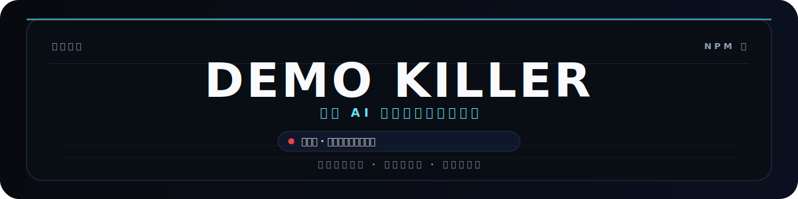

<p align="center">
  
</p>

<h1 align="center">Demo Killer</h1>

<p align="center">
  <strong>杀死你的 demo，转型成真正的可生产交付落地级。</strong>
</p>

<p align="center">
  面向 AI 生成项目的开源生产就绪闸门：当前以 npm CLI 和 agent guidance 接入 coding agents，并面向 MCP、Agent Skills、插件和 CI 扩展；在交付前识别 launch blockers、解释真实生产风险，并生成可复查的加固路径。
</p>

<p align="center">
  <a href="README.en.md">English</a>
  ·
  <a href="https://www.npmjs.com/package/demokiller">npm</a>
  ·
  <a href="https://github.com/AVIDS2/demokiller">GitHub</a>
  ·
  <a href="#快速开始">快速开始</a>
  ·
  <a href="#给-agent-使用">给 Agent 使用</a>
  ·
  <a href="#roadmap">Roadmap</a>
</p>

<p align="center">
  <a href="https://www.npmjs.com/package/demokiller"></a>
  <a href="https://www.npmjs.com/package/demokiller"></a>
  <a href="https://github.com/AVIDS2/demokiller/blob/main/LICENSE"></a>
  <a href="https://github.com/AVIDS2/demokiller/actions/workflows/ci.yml"></a>
  <a href="https://github.com/AVIDS2/demokiller/stargazers"></a>
</p>

<p align="center">
  <strong>CLI</strong>
  ·
  <strong>MCP</strong>
  ·
  <strong>Agent Skills</strong>
  ·
  <strong>Plugin</strong>
  ·
  <strong>Production Gate</strong>
</p>

---

> 正在用 Codex、Claude Code、Cursor、Gemini CLI 或其他 AI coding agent 做项目？先运行 `npx demokiller init .`，把 Demo Killer 写进交付前流程，让 `Launch Blocked` 真的阻断上线，而不是被 UI polish 和重构任务盖过去。

Demo Killer 是面向 AI 生成项目的开源生产就绪闸门。它让 Codex、Claude Code、Cursor、Gemini CLI 等 coding agents 在交付前先检查真实上线阻断项，而不是把能跑的 demo 当成可生产系统。

当前版本以 npm CLI 和 agent guidance 为主，Roadmap 会继续扩展到 MCP server、Agent Skills、Claude/Codex/Cursor 插件和 CI 闸门。它不是普通代码扫描器，也不是一个“生产就绪认证”。它更像一个本地的上线前生产工程师：

- 找出 launch blocker，而不是给一个虚假的高分。
- 用文件证据解释问题，而不是泛泛提醒“注意安全”。
- 讲清楚生产后果，而不是只列 checklist。
- 给出分阶段 hardening plan，而不是丢给你一堆无序任务。
- 让 AI agent 也能把 Demo Killer 当作交付前闸门。

## 产品快照

<table>
  <tr>
    <td><strong>包名</strong><br><code>demokiller</code></td>
    <td><strong>运行时</strong><br>Node 18+</td>
    <td><strong>当前入口</strong><br>npm CLI · MCP · Agent Skills · Agent guidance</td>
  </tr>
  <tr>
    <td><strong>输出</strong><br>Markdown · JSON</td>
    <td><strong>支持范围</strong><br>Next.js App Router · TypeScript</td>
    <td><strong>闸门</strong><br><code>Launch Blocked</code></td>
  </tr>
  <tr>
    <td><strong>当前命令</strong><br><code>inspect</code> · <code>init</code> · <code>benchmark</code> · <code>mcp</code></td>
    <td><strong>计划入口</strong><br>Agent Skills · Plugin · CI</td>
    <td><strong>使用场景</strong><br>上线前 · 交付前 · Agent 修复循环</td>
  </tr>
</table>

## 你可以用它做什么

- 在交付、上线、部署前检查本地项目或公开 GitHub 仓库。
- 找到真正会阻断上线的风险，而不是只拿一份笼统 checklist。
- 看到每个问题对应的文件证据、生产后果和修复验收标准。
- 输出 Markdown 给人看，输出 JSON 给 agent、脚本或 CI 继续处理。
- 通过 `demokiller init` 把规则写进 Codex、Claude Code、Cursor、Gemini CLI 等 agent 的工作流。

## 为什么需要它

现在很多开发者用 AI 可以很快做出“看起来完成”的项目：页面能打开，API 能返回，支付能回调，AI 能生成内容，数据库也能写入。

问题是：能跑不等于能上线。

真实生产会遇到的不是 demo 场景：

- 公开 API 被脚本刷爆，烧掉 OpenAI/Claude/Stripe 等付费额度。
- 管理接口缺少授权边界，用户数据被误删或越权修改。
- Webhook 没验签、没幂等，支付状态被伪造或重复处理。
- `.env.example` 不完整，部署时才发现关键变量缺失。
- Prisma schema 有了，但没有 migration，生产数据库不可复现。
- 关键 mutation 没日志，出事故时无法定位和恢复。

Demo Killer 的目标不是替你“美化 demo”，而是把这些 demo 幻觉杀掉。

## 快速开始

不需要先全局安装：

```powershell
npx demokiller --help
npx demokiller init .
npx demokiller inspect . --markdown
```

如果你的 agent 支持 MCP（Claude Code、Cursor、Claude Desktop），可以直接配置 MCP server，参见 [MCP Server](#mcp-server) 章节。

`init` 会把 Demo Killer 接入你的 agent 工作流：

```text
.demokiller/AGENT.md
AGENTS.md
```

之后 Codex、Claude Code、Cursor、Gemini CLI 等 agent 进入项目时，就能知道：上线、发布、部署、交付前必须运行 Demo Killer，并把 `Launch Blocked` 当作阻断信号。

## 一个典型输出

```text
Verdict: Launch Blocked

DK-AI-001: Paid AI capability is exposed without production abuse controls
Entry point: app/api/chat/route.ts
Production consequence: A public script can repeatedly trigger paid AI calls and create unexpected API costs.

Acceptance criteria:
- Requests require an authenticated user or trusted server-side session.
- Usage is bound to a user or tenant.
- Per-user or per-IP quota exists.
- Abnormal usage is logged.
```

Demo Killer 不会只说“这里可能有风险”。它会把风险拆成：

```text
入口 -> 能力 -> 资产 -> 缺失控制 -> 生产后果 -> 修复验收标准
```

这也是它和普通 linter、SAST、依赖漏洞扫描器的区别。

## 命令

| 命令 | 用途 |
| --- | --- |
| `npx demokiller init .` | 写入 agent 生产闸门说明 |
| `npx demokiller inspect . --markdown` | 检查当前项目，输出人类可读报告 |
| `npx demokiller inspect . --json` | 输出 agent/CI 可读 JSON |
| `npx demokiller inspect https://github.com/owner/repo --markdown` | 检查公开 GitHub 仓库 |
| `npx demokiller-mcp` | 启动 MCP server（供 Claude / Cursor 等客户端调用） |
| `demokiller benchmark <manifest-path>` | 运行 benchmark manifest |

也可以全局安装：

```powershell
npm install -g demokiller
demokiller inspect . --markdown
```

## 当前覆盖

Demo Killer 现在最适合检查这类项目：

- Next.js App Router + TypeScript 项目。
- AI/SaaS 风格应用，尤其是带 API route、付费能力、Webhook、数据库写入的项目。
- 本地目录，或可以公开访问的 GitHub 仓库。
- 希望在交付前拿到一份可执行 hardening list 的团队和独立开发者。

当前规则重点覆盖这些上线前高频风险：

| 规则 | 检查内容 |
| --- | --- |
| `DK-AI-001` | 公开 AI/付费能力是否缺少 auth、quota、rate limit、abuse logging |
| `DK-AUTH-001` | 管理/数据 mutation 路由是否缺少认证和授权 |
| `DK-WEBHOOK-001` | Stripe/payment webhook 是否缺少验签和幂等 |
| `DK-INPUT-001` | API 路由是否直接消费请求 body 而无 schema 校验 |
| `DK-ERR-001` | API 路由是否缺少错误处理，可能泄露内部信息 |
| `DK-DATA-001` | 数据库查询结果是否可能未经字段过滤直接返回 |
| `DK-CORS-001` | API 路由是否允许任意来源的跨域请求 |
| `DK-DEBUG-001` | 生产路由是否包含 console.log 等调试语句 |
| `DK-ENV-001` | 生产环境变量是否有明确 env contract |
| `DK-DB-001` | Prisma schema 是否缺少 migration 证据 |
| `DK-OBS-001` | 关键 mutation 路径是否缺少诊断日志 |

如果证据不足，报告会直接给出 `Insufficient Evidence`，避免把不确定性包装成“可以上线”。

## 如何理解结果

Demo Killer 不会把任何项目直接标成 `Production Ready`。上线仍然需要真实部署、运行时验证、压测、安全审查、监控告警和人工判断。

你只需要先看 verdict 和 Phase 0 findings：

| Verdict | 意味着什么 | 下一步 |
| --- | --- | --- |
| `Launch Blocked` | 存在明确上线阻断项 | 暂停发布，先修阻断项 |
| `Demo` | 有生产缺口，但不一定是最高级阻断 | 按 hardening plan 分阶段修 |
| `Production Candidate` | 当前规则没有发现已知阻断 | 继续做部署验证、压测、安全审查和人工 review |
| `Insufficient Evidence` | 证据不足，无法可靠判断 | 补充项目结构、换人工 review，或等待更多框架支持 |

## 给 Agent 使用

### 方式一：MCP（推荐）

如果你的 agent 支持 MCP，直接配置 `demokiller-mcp`，agent 就能调用 `inspect_project`、`list_launch_blockers`、`generate_hardening_plan`。详见 [MCP Server](#mcp-server) 章节。

### 方式二：CLI + Agent Guidance

推荐把 Demo Killer 放进每次交付前的固定流程：

```powershell
npx demokiller init .
npx demokiller inspect . --markdown
```

然后让 agent 按这个顺序工作：

1. 先读 `Launch Blocked` 和 Phase 0 findings。
2. 优先修复阻断项，再做 UI polish 或重构。
3. 每修一轮重新运行 `demokiller inspect . --markdown`。
4. 阻断项消失后，再进入部署验证、压测、安全审查和人工 review。

Demo Killer 不替 agent 写业务代码。它给 agent 一个可执行、可复查、能阻断交付的生产就绪标准。

## MCP Server

Demo Killer 内置 MCP server，支持 Claude Code、Cursor、Claude Desktop 等 MCP 客户端直接调用。

### 可用 Tools

| Tool | 用途 |
| --- | --- |
| `inspect_project` | 完整生产就绪检查，返回 verdict、findings、hardening plan |
| `list_launch_blockers` | 仅返回 blocker 级别发现，快速判断 go/no-go |
| `generate_hardening_plan` | 返回分阶段加固计划，指导修复顺序 |

### 配置示例

**Claude Code** — 在 `.claude/settings.json` 或全局设置中添加：

```json
{
  "mcpServers": {
    "demokiller": {
      "command": "npx",
      "args": ["-y", "demokiller-mcp"]
    }
  }
}
```

**Cursor** — 在 `.cursor/mcp.json` 中添加：

```json
{
  "mcpServers": {
    "demokiller": {
      "command": "npx",
      "args": ["-y", "demokiller-mcp"]
    }
  }
}
```

**Claude Desktop** — 在 `claude_desktop_config.json` 中添加：

```json
{
  "mcpServers": {
    "demokiller": {
      "command": "npx",
      "args": ["-y", "demokiller-mcp"]
    }
  }
}
```

也可以全局安装后直接指向可执行文件：

```powershell
npm install -g demokiller
```

```json
{
  "mcpServers": {
    "demokiller": {
      "command": "demokiller-mcp"
    }
  }
}
```

## Agent Skill

`demokiller init .` 会自动写入 `.claude/skills/demokiller/SKILL.md`，遵循 [Agent Skills](https://agentskills.io) 开放标准。Claude Code、Cursor、Copilot、Gemini CLI 等支持此标准的 agent 会自动识别。

使用方式：

- **手动触发**：在 Claude Code 中输入 `/demokiller`，agent 会运行检查并按 phase 顺序修复。
- **自动触发**：当对话涉及上线、部署、发布、go live 等场景时，agent 会自动加载此 skill 并执行检查。
- **MCP 联动**：如果已配置 `demokiller-mcp`，agent 可以通过 MCP tools 直接调用，无需 CLI。

Skill 文件是幂等的——重复运行 `demokiller init .` 不会覆盖已有的自定义 skill。

## 开发与贡献

想贡献规则、接入方式或 benchmark 样本，可以先跑本地检查：

```powershell
git clone https://github.com/AVIDS2/demokiller.git
cd demokiller
npm install
npm test
npm run typecheck
npm run build
```

项目也内置了公开 GitHub 样本 benchmark，用来检查规则是否还能覆盖不同项目形态：

```powershell
npm run benchmark
```

发布前推荐检查：

```powershell
npm test
npm run typecheck
npm run build
npm audit --json
npm pack --dry-run
```

## Roadmap

- Plugin 入口，让非 MCP / 非 Skill 的 agent 也能原生接入。
- GitHub Actions / PR comment，用在团队上线前 review。
- 更广支持：更多框架、更多生产风险域、更多 benchmark 样本。

## License

MIT
